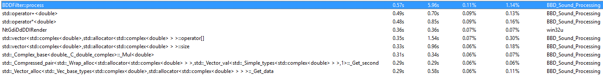
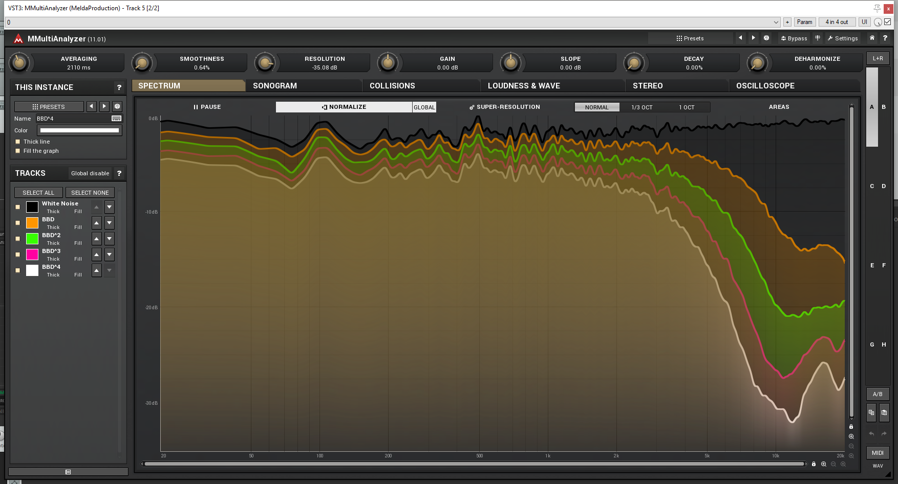

## Progress for November 4, 2018

* Tried to replace gIn, gOut, pIn and pOut functions with look-up tables to improve performance
    * Worked kind of. It's now possible to run 8 instances without dropouts (4 stereo instances), whereas before there were dropouts with even 2 instances (2 mono instances).

* Performance still awful. Ran VerySleepy profiling, results:

### Frequency Response for each stage

